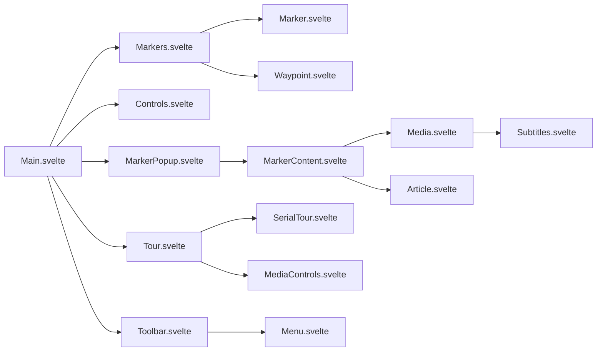

# Micrio Client Svelte Application Analysis (Components)

This document provides an analysis of the Micrio Client's frontend application, focusing on its Svelte components located within the `src/svelte/` directory. The analysis is based on code comments and component structure observed during the review process.

## Overview

The Micrio Client appears to be a sophisticated web application for viewing and interacting with high-resolution images, including standard images, deep zoom images, 360 panoramas, and potentially 3D objects (Omni). It utilizes Svelte (specifically Svelte 5 Runes mode based on the commenting style) for its component architecture and leverages TypeScript for type safety.

The application features interactive elements like markers, tours (video and marker-based), embedded content (videos, iframes, other Micrio images), and UI controls for navigation, zoom, fullscreen, audio, and subtitles. It seems to interact with a WebAssembly (Wasm) backend for core rendering and potentially image processing tasks.

## Key Architectural Patterns Observed

*   **Component-Based:** The UI is broken down into reusable Svelte components located in `common/`, `components/`, `ui/`, and `virtual/` directories.
*   **Context API:** Svelte's `getContext` is used extensively to share the main `micrio` element instance (likely `HTMLMicrioElement`) and its associated state stores (`state`, `current`, `_lang`, `events`, etc.) throughout the component tree.
*   **Svelte Stores:** Svelte stores (`writable`) are used for managing global and local component state (e.g., active tour, active marker, UI visibility, loading state, user interaction flags). Reactive declarations (`$:`) are used frequently to derive state and update the UI automatically.
*   **Event Dispatching:** Custom events are dispatched from the main `micrio` element (`micrio.events.dispatch`) to signal application-level events (e.g., `tour-start`, `marker-click`, `audio-init`, `lang-switch`).
*   **TypeScript:** The `<script lang="ts">` tag indicates the use of TypeScript for strong typing within components.
*   **CSS Variables:** The application makes heavy use of CSS variables (e.g., `--micrio-color`, `--micrio-button-size`) for theming and consistent styling.

## Component Interaction Diagram

## Component Breakdown

### `src/svelte/common/`

*   **`Article.svelte`:** A simple wrapper component, likely providing standard styling for article-like content within popovers or markers.
*   **`MarkerContent.svelte`:** Renders the main content area for a marker popup, including title, body text, and potentially embedded media (delegated to `Media.svelte`). Handles language variations (`i18n`).
*   **`Subtitles.svelte`:** Manages the display of subtitles for media elements. It fetches and parses VTT files, synchronizes subtitle display with the `currentTime` of a media element (passed via context), and responds to a global `captionsEnabled` store.

### Common Component Props/Events

| Component | Props | Events |
|-----------|-------|--------|
| **MarkerContent** | `markerData`, `lang` | `close` |
| **Subtitles** | `currentTime`, `src` | `cuechange` |
| **Article** | `content`, `title` | - |

### `src/svelte/components/`

*   **`Controls.svelte`:** Acts as a container for various UI control elements (ZoomButtons, Fullscreen, potentially others), likely positioning them absolutely on the screen. Hides controls during tours/marker interactions.
*   **`Main.svelte`:** Appears to be the root Svelte component, orchestrating the overall UI. It initializes core controllers (Wasm, WebGL, Canvas, Events, State), renders main UI elements (Logo, Controls, Popover, Tour container), and manages the lifecycle of the current `MicrioImage`.
*   **`Marker.svelte`:** Renders an individual marker element on the image. Calculates screen position based on image coordinates and camera view. Handles hover effects, click actions (opening popups, triggering tours, following links), displays titles (conditionally), and interacts with clustering logic in `Markers.svelte`. Exposes an interface for external interaction (e.g., editor).
*   **`MarkerPopup.svelte`:** Renders the popup container when a marker is clicked. Uses `MarkerContent` to display the marker's details. Handles positioning and closing logic.
*   **`Media.svelte`:** A versatile component for rendering different media types: HTML5 video/audio, iframes, and potentially Cloudflare video streams (`cfvid://`). Manages playback state (play, pause, mute, time, duration, ended), controls visibility, subtitle display (using `Subtitles.svelte`), and dispatches timeupdate events. Handles autoplay restrictions and interaction requirements.
*   **`MicrioGallery.svelte`:** Displays a gallery of images or videos, likely using a swiper/carousel mechanism (potentially integrating with `GallerySwiper.ts`). Handles navigation between gallery items.
*   **`Popover.svelte`:** Renders a modal dialog (`<dialog>`) used for displaying marker content, galleries, or custom pages. Manages opening/closing, focus, and internal navigation/actions.
*   **`Toolbar.svelte`:** Renders the main top toolbar, dynamically generating menus based on image data (pages, marker tours, video tours). Uses the recursive `Menu.svelte` component. Handles mobile responsiveness with a toggle button.
*   **`Waypoint.svelte`:** Renders interactive waypoints for navigating between 360 images within a "space". Calculates 3D position/orientation and handles click navigation to the target image.

### Component Props/Events

| Component | Props | Events |
|-----------|-------|--------|
| **Marker** | `data`, `view`, `active` | `click`, `hover` |
| **MarkerPopup** | `marker`, `position` | `close` |
| **Media** | `src`, `type`, `autoplay` | `play`, `pause`, `ended` |
| **Popover** | `content`, `title` | `close` |
| **Toolbar** | `items`, `activeTour` | `select` |
| **Waypoint** | `target`, `position` | `navigate` |

### `src/svelte/ui/`

*   **`Button.svelte`:** A reusable button component that can render as `<button>` or `<a>`. Displays standard Font Awesome icons (via `Icon.svelte`) or custom image icons. Handles disabled/active states and accessibility attributes.
*   **`ButtonGroup.svelte`:** A simple container to visually group buttons vertically, applying shared styling (background, shadow, border-radius). Used for controls like zoom.
*   **`Dial.svelte`:** A horizontal dial control, likely used for rotating Omni (3D object) views. Responds to drag interactions and dispatches 'turn' events with calculated frame index. Optionally displays rotation degrees.
*   **`Fullscreen.svelte`:** Provides a button to toggle fullscreen mode for a target HTML element. Handles browser API differences (standard vs. webkit).
*   **`Icon.svelte`:** Renders icons, prioritizing custom HTML from settings over standard Font Awesome icons looked up by name. Uses `svelte-fa` for Font Awesome rendering.
*   **`Logo.svelte`:** Displays the animated Micrio logo in the top-left corner, linking to micr.io. Hides during tours/markers and shows a loading animation.
*   **`LogoOrg.svelte`:** Displays the organization logo (if provided in image data) in the top-right corner, linking to the organization's website. Includes logic for potentially using specific resolutions from Micrio's asset system.
*   **`ProgressBar.svelte`:** A reusable progress bar, typically for media playback (video tours, audio). Displays progress based on `currentTime` and `duration`, shows time remaining/total, and allows seeking via slotted content (likely a draggable handle).
*   **`ProgressCircle.svelte`:** Displays a circular SVG progress indicator, primarily used for initial loading progress display.

### UI Component Props/Events

| Component | Props | Events |
|-----------|-------|--------|
| **Button** | `icon`, `label`, `disabled` | `click` |
| **ButtonGroup** | `vertical` | - |
| **Dial** | `value`, `min`, `max` | `change` |
| **Fullscreen** | `target` | `enter`, `exit` |
| **Icon** | `name`, `size` | - |
| **ProgressBar** | `current`, `max` | `seek` |

### `src/svelte/virtual/`

*   **`AudioController.svelte`:** Manages the global Web Audio API context. Initializes the `AudioContext` upon user interaction, handles listener position/orientation updates for positional audio based on camera movement, and renders the `AudioPlaylist` component.
*   **`AudioPlaylist.svelte`:** Plays a list of audio files sequentially using a single HTMLAudioElement. Handles looping and volume control. Used for background music.
*   **`Embed.svelte`:** Renders various types of embedded content (Micrio images, videos, iframes, standard images/SVGs) within a parent image. Calculates 2D/3D positioning and handles rendering via WebGL (using `GLEmbedVideo.ts`) or standard HTML elements (`Media.svelte`, ``). Manages video playback state, including pause-on-zoom logic.
*   **`Events.svelte`:** Manages timed events associated with video tours. Monitors `currentTime` and dispatches `tour-event` when events become active or inactive.
*   **`Markers.svelte`:** Renders all visible markers and waypoints for a given `MicrioImage`. Instantiates `Marker.svelte` and `Waypoint.svelte` components. Handles marker clustering logic and manages the state for fancy side labels (for Omni objects).
*   **`SerialTour.svelte`:** Manages the playback and UI specifically for *serial* marker tours (tours spanning multiple markers/images). Handles step navigation, audio/video playback for each step (using `Media.svelte`), overall progress bar display (using `ProgressBar.svelte`), chapter lists, and playback controls.
*   **`Tour.svelte`:** Acts as the main controller/wrapper for all tour types (Video, standard Marker, Serial Marker, Scrollable Marker). It determines the tour type and renders the appropriate component (`Media.svelte`, `SerialTour.svelte`, or manages state for standard/scrollable tours). Handles tour start/stop, UI state (minimization, controls visibility), and event dispatching.

### Virtual Component Props/Events

| Component | Props | Events |
|-----------|-------|--------|
| **Embed** | `data`, `view` | `load`, `error` |
| **Markers** | `markers`, `view` | `markerClick` |
| **Tour** | `tourData`, `active` | `start`, `end` |
| **SerialTour** | `steps`, `currentStep` | `next`, `prev` |
| **AudioController** | `sources`, `position` | `play`, `pause` |

## Functionality Summary

Based on the Svelte components, the application provides the following core functionalities:

*   **Image Viewing:** Displaying various image types (standard, deep zoom, 360, Omni).
*   **Navigation:** Panning and zooming within images (likely handled by `Camera.ts` and Wasm).
*   **Markers:** Displaying interactive points of interest on images, with popups containing text, images, and media.
*   **Tours:**
    *   **Video Tours:** Playing synchronized video/audio with timed events.
    *   **Marker Tours:** Guiding users through a sequence of predefined views or marker locations.
    *   **Serial Tours:** Complex marker tours potentially spanning multiple images with synchronized audio/video per step.
    *   **Scrollable Tours:** Presenting marker content sequentially in a scrollable format.
*   **Embedding:** Displaying external content (videos, iframes, images, other Micrio instances) within an image, positioned in 2D or 3D space.
*   **UI Controls:** Providing standard controls for zoom, fullscreen, playback (play/pause, volume, subtitles), tour navigation, and menu access.
*   **Responsiveness:** Adapting layout and controls for different screen sizes (e.g., mobile toolbar toggle).
*   **Theming/Branding:** Allowing customization via CSS variables and organization logos.
*   **Internationalization (i18n):** Supporting multiple languages for UI text and potentially marker/tour content.
*   **State Management:** Maintaining application state (active image, view, marker, tour, UI visibility, etc.) using Svelte stores and context.
*   **WebGL/Wasm Integration:** Offloading core rendering and potentially complex calculations to WebGL and WebAssembly.

## Further Analysis Needed

A complete understanding requires analyzing:

*   **`src/ts/`:** Core logic for camera control, event handling, state management, WebGL/Wasm interaction, utilities, image class (`MicrioImage`), etc.
*   **`src/types/`:** Data structures (`Models`) used throughout the application.
*   **`src/wasm/`:** Understanding the interface and capabilities of the WebAssembly module.
*   **`index.html` / `main.ts` (or equivalent):** Application entry point and initialization.

This analysis provides a good foundation based on the UI components structure and interactions.
