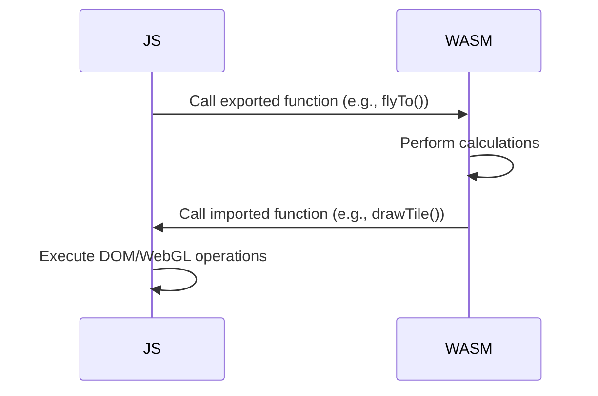

# Micrio WebAssembly (Wasm) Module Analysis

This document provides an AI-readable analysis of the Micrio WebAssembly module's architecture, components, and functionality, based on the files within the `src/wasm` directory. This module is written in AssemblyScript and compiled to Wasm for performance-critical tasks.

## Architecture Overview

The Wasm module complements the main JavaScript application by handling computationally intensive operations related to image rendering, camera control, and animation. It operates on data structures representing canvases, images, views, and camera states. Communication with the JavaScript host happens through exported functions defined in `exports.ts` and imported functions declared in `main.ts` (like `aniDone`, `drawTile`).

## Core Components

1.  **`Main` (`main.ts`)**:
    *   The central orchestrator within the Wasm module.
    *   Holds a list of all active `Canvas` instances.
    *   Manages the main render loop (`shouldDraw`, `draw`).
    *   Stores global settings (animation durations, drag elasticity, etc.).
    *   Tracks overall rendering progress and animation state.
    *   Declares imported functions required from the JS host (e.g., for drawing tiles, reporting animation completion).

2.  **`Canvas` (`canvas.ts`)**:
    *   Represents a single rendering surface or viewport, often corresponding to a `MicrioImage` in the JS layer.
    *   Contains references to its constituent `Image` instances (tile sources).
    *   Manages its own `View`, `Camera` (for 2D), `WebGL` (for 360), `Ani` (animation), and `Kinetic` (dragging) controllers.
    *   Handles visibility, opacity, and fading (`setVisible`, `fadeIn`, `fadeOut`).
    *   Determines which tiles need rendering based on the current view (`shouldDraw`).
    *   Orchestrates the drawing process for its images (`draw`).
    *   Manages transformations for nested canvases (used in grids) via `area`, `currentArea`, `targetArea`.
    *   Handles specific logic for different canvas types (standard, 360, gallery, omni, grid children).

3.  **`Image` (`image.ts`)**:
    *   Represents a single image source (usually tiled) within a `Canvas`.
    *   Manages multiple resolution layers (`Layer` inner class).
    *   Calculates the target layer and specific tiles needed based on the current view and scale (`getTiles`, `getTargetLayer`).
    *   Determines if it should be rendered based on visibility and view intersection (`shouldRender`, `outsideView`).
    *   Manages its own opacity for fading effects (`opacityTick`).
    *   Handles specialized rendering calculations for images embedded within a 360 canvas (`setDrawRect`, `getEmbeddedScale`).

4.  **`Camera` (`camera.ts`)**:
    *   Handles **2D camera** logic for a `Canvas`.
    *   Manages 2D view properties (scale, position).
    *   Calculates and maintains scale limits (`minScale`, `maxScale`, `coverScale`).
    *   Converts between screen pixel coordinates and relative image coordinates (`getCoo`, `getXY`).
    *   Handles coordinate transformations specific to omni-objects (`getXYOmni`, `getXYOmniCoo`).
    *   Applies view limits and corrections (`setView`, `limit`).
    *   Processes user input for panning (`pan`) and zooming (`zoom`).
    *   Manages pinch gesture state and calculations (`pinch`, `pinchStart`, `pinchStop`).

5.  **`Ani` (`camera.ani.ts`)**:
    *   Manages camera **animations** (fly-to view, zoom).
    *   Tracks animation state (start time, duration, progress, paused).
    *   Calculates intermediate camera states frame-by-frame using easing functions (`step`, `Bicubic` from `utils.ts`).
    *   Handles different animation types (standard fly-to, jump zoom, omni-frame transitions).
    *   Invokes imported `aniDone` or `aniAbort` functions upon completion or interruption.

6.  **`Kinetic` (`camera.kinetic.ts`)**:
    *   Implements inertial scrolling/dragging behavior.
    *   Accumulates velocity based on recent pan/rotate inputs (`addStep`).
    *   Applies a decaying velocity to the camera/view in each frame (`step`) until motion stops.

7.  **`WebGL` (`webgl.ts`)**:
    *   Handles **360 camera and rendering** logic for a `Canvas`.
    *   Manages the 3D perspective matrix (`pMatrix`) and related transformation matrices.
    *   Controls camera orientation via yaw and pitch (`rotate`, `setDirection`, `limitYaw`, `limitPitch`).
    *   Manages zoom in 360 space by adjusting the perspective (`zoom`, `setPerspective`).
    *   Converts between screen coordinates and spherical coordinates (`getCoo`, `getXYZ`, `getVec3`).
    *   Calculates transformation matrices (`getMatrix`, `getQuad`) for placing embedded elements (like markers or other images) correctly within the 360 sphere.
    *   Generates the vertex data for rendering the 360 sphere geometry (`setTile360`).

8.  **Matrix/Vector Math (`webgl.mat.ts`)**:
    *   Provides `Mat4` (4x4 Matrix) and `Vec4` (4D Vector) classes.
    *   Implements essential matrix/vector operations (identity, copy, rotation, scaling, translation, perspective projection, inversion, multiplication, transformation). Appears to be a partial port of gl-matrix.

9.  **Shared Structures & Utilities**:
    *   `shared.ts`: Defines common data structures (`View`, `Coordinates`, `Viewport`, `DrawRect`) used across different modules.
    *   `utils.ts`: Contains mathematical helper functions (`pyth`, `atan2`, `mod1`) and easing curve implementations (`Bicubic`).
    *   `globals.ts`: Defines constants, primarily for 360 sphere geometry segmentation.

## Functionality

The Wasm module is primarily responsible for:

*   **Camera Math:** Calculating view transformations, scale, coordinate conversions (2D and 360).
*   **Tile Calculation:** Determining the optimal resolution layer and specific tiles required for the current view.
*   **Animation Stepping:** Calculating intermediate states for camera animations (fly-to, zoom) frame by frame.
*   **Kinetic Scrolling:** Applying inertial movement after drag/pan actions.
*   **360 Rendering Logic:** Managing 3D perspective, rotations, and calculating positions/matrices for elements within the 360 sphere.
*   **Grid/Embed Transformations:** Calculating the position and size of child canvases or embedded images within a parent canvas.
*   **State Management:** Maintaining the internal state of canvases, images, cameras, and animations.

## Interaction with JavaScript

*   **Exports (`exports.ts`):** Provides a clear API for the JavaScript host to interact with the Wasm module. Functions are exported to create/manage canvases and images, trigger actions (pan, zoom, fly-to), set properties (limits, opacity, area), and retrieve state information (view, coordinates, scale).
*   **Imports (`main.ts` declarations):** The Wasm module declares functions it expects the JS host to provide, primarily for:
    *   Requesting tile drawing (`drawTile`, `drawQuad`).
    *   Getting tile status (`getTileOpacity`).
    *   Setting tile status (`setTileOpacity`).
    *   Updating matrices/viewports in the host environment (`setMatrix`, `setViewport`).
    *   Signaling animation completion/abortion (`aniDone`, `aniAbort`).
    *   Reporting view/viewport changes (`viewSet`, `viewportSet`).
    *   Reporting visibility changes (`setVisible`, `setVisible2`).

By offloading these tasks to Wasm, the application achieves higher performance and smoother interactions, especially during complex animations and rendering scenarios.

## JavaScript/WASM Interaction

The interaction between JavaScript and WASM is crucial for the application's performance. Here's how the two layers communicate:

1. **Data Passing**:
   - Viewports and camera states are passed as simple numeric arrays
   - Complex structures use shared memory buffers
   - Strings are passed as pointers to UTF-8 encoded data

2. **Function Calls**:

3. **Memory Management**:
   - WASM manages its own linear memory
   - JS can access WASM memory via exported functions
   - Critical data structures are allocated in WASM memory
   - JS uses views (Uint8Array, Float32Array) to access WASM memory

4. **Performance Considerations**:
   - Minimize JS/WASM boundary crossings
   - Batch operations when possible
   - Use shared memory for large data transfers
   - Optimize hot paths with WebAssembly SIMD instructions
