# Micrio Client Architecture

## 1. Overview

The Micrio client is a high-performance web component (`<micr-io>`) for displaying deeply zoomable images and interactive content. It's built primarily using:

*   **TypeScript:** For the core application logic, component orchestration, and interactions.
*   **Svelte 4:** For building the reactive user interface components.
*   **WebAssembly (Wasm):** Compiled from AssemblyScript (`src/wasm`), used for performance-critical tasks like rendering calculations, camera math, and animations.
*   **WebGL:** For rendering tiled images, 360-degree panoramas, and embedded elements efficiently.

## 2. Core Layers

The application is structured into three main layers:

### Core TypeScript Layer (`src/ts/`)

This layer acts as the central orchestrator, managed primarily by the `HTMLMicrioElement` class (`element.ts`) which defines the `<micr-io>` custom element. Its responsibilities include:

*   Initializing and managing the lifecycle of the web component.
*   Loading and managing one or more `MicrioImage` instances (`image.ts`), each representing a viewable image and its associated data/state.
*   Interfacing with the WebAssembly module via the `Wasm` controller (`wasm.ts`).
*   Managing the WebGL context and rendering pipeline via the `WebGL` controller (`webgl.ts`).
*   Handling user input events via the `Events` controller (`events.ts`).
*   Managing global application state (`State.Main` in `state.ts`).
*   Mounting and providing data to the Svelte UI layer.
*   Handling routing (`router.ts`) and analytics (`analytics.ts`).

*For more details, see [.ai/app-analysis.md](.ai/app-analysis.md)*

### Svelte UI Layer (`src/svelte/`)

This layer is responsible for rendering the user interface. It's built with Svelte 4 components organized into `common/`, `components/`, `ui/`, and `virtual/` directories.

*   The root component is `Main.svelte`, which orchestrates the display of all other UI elements.
*   Components react to changes in the application state (managed by `State.Main` and `State.Image` from the TS layer) and image data/settings stores.
*   It provides UI elements like the toolbar, control buttons, minimap, marker popups, tour controls, galleries, and popovers.
*   "Virtual" components often handle complex logic tightly coupled with the core TS/Wasm layers (e.g., `virtual/Markers.svelte` manages marker rendering logic, `virtual/Tour.svelte` manages tour playback UI).

*For more details, see [.ai/svelte-analysis.md](.ai/svelte-analysis.md)*

### WebAssembly Layer (`src/wasm/`)

Written in AssemblyScript and compiled to Wasm, this layer handles computationally intensive tasks to ensure smooth performance.

*   Managed by the `Main` class (`main.ts`) within Wasm.
*   Contains classes representing `Canvas`, `Image`, `Camera` (2D), `WebGL` (360), `Ani` (animation), and `Kinetic` (dragging).
*   Performs camera math, view transformations, coordinate conversions (2D & 360).
*   Calculates which image tiles are needed for the current view.
*   Steps through camera animations frame-by-frame.
*   Handles 360-degree rendering logic and matrix calculations.
*   Interacts with the JavaScript host via exported functions (`exports.ts`) and imported functions (declared in `main.ts`) for tasks like requesting tile draws or signaling animation completion.

*For more details, see [.ai/wasm-analysis.md](.ai/wasm-analysis.md)*

## 3. Data Flow & Models

The application primarily uses two data models, defined in `src/types/models.ts`:

*   **`ImageInfo`:** Static image metadata (dimensions, type, settings). Usually loaded from `info.json`.
*   **`ImageData`:** Dynamic, language-specific content (markers, tours, embeds, pages). Usually loaded from `pub.json` (V5+) or `data.[lang].json` (V4).

Data is typically fetched using the browser's Fetch API (`ts/utils.ts`). Optional binary archives (`.bin`) can be used for pre-packaged gallery thumbnails or omni-object base layers.

## 4. Architecture Diagram

```mermaid
graph TD
    subgraph "Browser / HTML"
        HTML[index.html] --> CustomElement["<micr-io>"]
        BrowserEvents["Browser Events (Mouse, Touch, Keyboard, Resize)"] --> TSEvents["ts/events.ts<br>Events"]
        BrowserAPIs["Browser APIs (WebGL, Web Audio, Fetch, Fullscreen, Share)"]
    end

    subgraph Data
        InfoJSON["info.json<br>(ImageInfo)"]
        DataJSON["pub.json / data.[lang].json<br>(ImageData)"]
        WasmBinary["micrio.wasm"]
        TileImages["Image Tiles (JPG/WebP/PNG)"]
        ArchiveBin[".bin Archive (Optional)"]
    end

    subgraph "Core TypeScript Layer"
        CustomElement --> Element["ts/element.ts<br>HTMLMicrioElement"]

        Element --> WasmController["ts/wasm.ts<br>Wasm"]
        Element --> WebGLController["ts/webgl.ts<br>WebGL"]
        Element --> TSEvents
        Element --> StateMain["ts/state.ts<br>State.Main"]
        Element --> CanvasController["ts/canvas.ts<br>Canvas"]
        Element --> Router["ts/router.ts<br>Router"]
        Element --> Analytics["ts/analytics.ts<br>GoogleTag"]
        Element --> Utils["ts/utils.ts"]
        Element --> Globals["ts/globals.ts"]
        Element -- Manages --> ImageInstances("MicrioImage[]<br>canvases")

        ImageInstances -- Contains --> MicrioImage["ts/image.ts<br>MicrioImage"]
        MicrioImage -- Uses --> ImageInfoStore["info Store<br>(Models.ImageInfo)"]
        MicrioImage -- Uses --> ImageDataStore["data Store<br>(Models.ImageData)"]
        MicrioImage -- Uses --> SettingsStore["settings Store<br>(Models.ImageInfo.Settings)"]
        MicrioImage -- "Has a" --> TSCamera["ts/camera.ts<br>Camera"]
        MicrioImage -- "Has a" --> StateImage["ts/state.ts<br>State.Image"]
        MicrioImage -- "Interacts with" --> WasmController

        Utils --> InfoJSON
        Utils --> DataJSON
        Utils --> ArchiveBin

        ImageInfoStore -- "Loaded from" --> InfoJSON
        ImageDataStore -- "Loaded from" --> DataJSON

        WasmController --> WasmBinary
        WebGLController --> BrowserAPIs
        TSEvents --> Element
        StateMain -- Manages --> StateImage
        Router --> BrowserEvents["URL Hash Change"]

        Element -- Mounts --> SvelteMain["svelte/Main.svelte"]
    end

    subgraph "Svelte UI Layer"
        SvelteMain -- "Uses Context" --> Element
        SvelteMain -- Renders --> SvelteToolbar["components/Toolbar.svelte"]
        SvelteMain -- Renders --> SvelteControls["common/Controls.svelte"]
        SvelteMain -- Renders --> SvelteMarkers["virtual/Markers.svelte"]
        SvelteMain -- Renders --> SvelteMinimap["components/Minimap.svelte"]
        SvelteMain -- Renders --> SveltePopup["components/MarkerPopup.svelte"]
        SvelteMain -- Renders --> SveltePopover["components/Popover.svelte"]
        SvelteMain -- Renders --> SvelteTour["virtual/Tour.svelte"]
        SvelteMain -- Renders --> SvelteEmbed["virtual/Embed.svelte"]
        SvelteMain -- Renders --> SvelteAudio["virtual/AudioController.svelte"]
        SvelteMain -- Renders --> SvelteGallery["common/Gallery.svelte"]
        SvelteMain -- Renders --> SvelteMedia["components/Media.svelte"]
        SvelteMain -- Renders --> SvelteUI["ui/* (Buttons, Icons, etc)"]

        SvelteToolbar -- Uses --> SvelteMenu["components/Menu.svelte"]
        SvelteMarkers -- Uses --> SvelteMarker["virtual/Marker.svelte"]
        SvelteMarkers -- Uses --> SvelteWaypoint["components/Waypoint.svelte"]
        SveltePopup -- Uses --> SvelteMarkerContent["common/MarkerContent.svelte"]
        SvelteMarkerContent -- Uses --> SvelteMedia
        SvelteMarkerContent -- Uses --> SvelteArticle["common/Article.svelte"]
        SvelteTour -- Uses --> SvelteSerialTour["virtual/SerialTour.svelte"]
        SvelteTour -- Uses --> SvelteMediaControls["components/MediaControls.svelte"]
        SvelteEmbed -- Uses --> MicrioImage
        SvelteEmbed -- Uses --> SvelteMedia
        SvelteAudio -- Uses --> SvelteAudioLoc["virtual/AudioLocation.svelte"]
        SvelteAudio -- Uses --> SvelteAudioPlaylist["virtual/AudioPlaylist.svelte"]

        SvelteMain -- Reads --> StateMain
        SvelteMain -- Reads --> StateImage
        SvelteMain -- Reads --> ImageInfoStore
        SvelteMain -- Reads --> ImageDataStore
        SvelteMain -- Reads --> SettingsStore

        SvelteControls -- Calls --> TSCamera
        SvelteControls -- Calls --> Element["Fullscreen API"]
        SvelteControls -- Calls --> BrowserAPIs["Share API"]
        SvelteMarkers -- Reads --> ImageDataStore
        SvelteMarkers -- Reads --> StateImage["view Store"]
        SvelteMarker -- Calls --> StateImage["marker Store"]
        SveltePopup -- Calls --> StateImage["marker Store"]
        SveltePopup -- Calls --> StateMain["tour Store"]
        SvelteTour -- "Reads/Writes" --> StateMain["tour Store"]
        SveltePopover -- "Reads/Writes" --> StateMain["popover Store"]
    end

    subgraph "WebAssembly Layer (src/wasm)"
        WasmController -- "Loads & Interacts" --> WasmMain["main.ts<br>Main"]

        WasmMain -- Manages --> WasmCanvasInstances("Canvas[]")
        WasmCanvasInstances -- Contains --> WasmCanvas["canvas.ts<br>Canvas"]
        WasmCanvas -- Manages --> WasmImageInstances("Image[]")
        WasmCanvas -- "Has a" --> WasmCamera["camera.ts<br>Camera (2D)"]
        WasmCanvas -- "Has a" --> WasmWebGL["webgl.ts<br>WebGL (360)"]
        WasmCanvas -- "Has a" --> WasmAni["camera.ani.ts<br>Ani"]
        WasmCanvas -- "Has a" --> WasmKinetic["camera.kinetic.ts<br>Kinetic"]
        WasmImageInstances -- Contains --> WasmImage["image.ts<br>Image"]
        WasmImage -- Manages --> WasmLayer["Layer[]"]

        WasmWebGL -- Uses --> WasmMat["webgl.mat.ts<br>Mat4, Vec4"]
        WasmAni -- Uses --> WasmUtils["utils.ts<br>Bicubic"]

        WasmMain -- "Calls JS" --> DrawTile["JS: drawTile(...)"]
        WasmMain -- "Calls JS" --> AniDone["JS: aniDone(...)"]
        WasmMain -- "Calls JS" --> ViewSet["JS: viewSet(...)"]
        WasmMain -- "Calls JS" --> ViewportSet["JS: viewportSet(...)"]

        WasmController -- Calls --> WasmExports["exports.ts<br>Exported Functions"]
        WasmExports -- Calls --> WasmMain
        WasmExports -- Calls --> WasmCanvas
        WasmExports -- Calls --> WasmCamera
        WasmExports -- Calls --> WasmWebGL
        WasmExports -- Calls --> WasmAni
        WasmExports -- Calls --> WasmKinetic

        DrawTile --> TileImages
        DrawTile --> WebGLController["WebGL Rendering"]
    end
```

## 5. Key Interactions

*   **JS <-> Wasm:** The Core TypeScript layer interacts with the Wasm module through the `Wasm` controller (`ts/wasm.ts`). It calls exported Wasm functions (`wasm/exports.ts`) to trigger actions (e.g., camera movements, setting state) and provides necessary data. The Wasm module calls back into JavaScript (via imported functions declared in `wasm/main.ts`) to request tile drawing, report animation completion, or update JS-side state like the current view.
*   **TS Core <-> Svelte UI:** The `HTMLMicrioElement` mounts the root Svelte component (`Main.svelte`) and passes itself down via Svelte's context API. Svelte components access core functionality and state through this context (e.g., `micrio.state`, `micrio.current`, `micrio.open()`). State changes are propagated reactively using Svelte stores managed within the TS layer (`ts/state.ts`). UI events often trigger methods on the `micrio` instance or update its state stores.