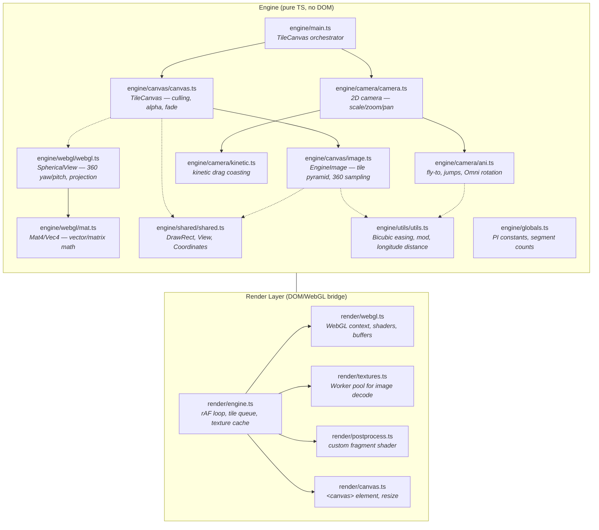

# Micrio Client Architecture

> **116 TypeScript source files** spanning **~22K lines**.

## Overview

Micrio Client is a **Web Component-based** zoomable image viewer. It renders gigapixel images, 360&deg; panoramas, and 3D Omni objects entirely in the browser using WebGL tiling.

The architecture is **framework-agnostic**: all UI is built from native custom elements (`HTMLElement` subclasses). A lightweight reactive store system wires data changes to DOM updates without any virtual DOM or compiler.

---

## Component Map


```mermaid
graph TB
  subgraph Root["<micr-io> &lt;micrio-main&gt;"]
    direction TB
    MAIN["micrio-main<br/><i>MicrioMain</i>"]
    ERR["micrio-error<br/><i>MicrioError</i>"]
    PROG["micrio-progress-circle<br/><i>MicrioProgressCircle</i>"]
  end

  subgraph TopBar["Toolbar &amp; Logos"]
    TBAR["micrio-toolbar<br/><i>MicrioToolbar</i>"]
    MENU["micrio-menu<br/><i>MicrioMenu</i>"]
    LOGO["micrio-logo<br/><i>MicrioLogo</i>"]
    LORG["micrio-logo-org<br/><i>MicrioLogoOrg</i>"]
    DET["micrio-details<br/><i>MicrioDetails</i>"]
    TBAR --> MENU
  end

  subgraph Controls["Controls &amp; Nav"]
    CTRL["micrio-controls<br/><i>MicrioControls</i>"]
    ZOOM["micrio-zoom-buttons<br/><i>MicrioZoomButtons</i>"]
    FS["micrio-fullscreen<br/><i>MicrioFullscreen</i>"]
    BG["micrio-button-group<br/><i>MicrioButtonGroup</i>"]
    MMAP["micrio-minimap<br/><i>MicrioMinimap</i>"]
    CTRL --> ZOOM
    CTRL --> FS
    CTRL --> BG
  end

  subgraph Markers["Markers &amp; Waypoints"]
    MKS["micrio-markers<br/><i>MicrioMarkers</i>"]
    MK["micrio-marker<br/><i>MicrioMarker</i>"]
    POP["micrio-marker-popup<br/><i>MicrioMarkerPopup</i>"]
    MCT["micrio-marker-content<br/><i>MicrioMarkerContent</i>"]
    ART["micrio-article<br/><i>MicrioArticle</i>"]
    SWP["micrio-swipe-gallery<br/><i>MicrioSwipeGallery</i>"]
    WPT["micrio-waypoint<br/><i>MicrioWaypoint</i>"]
    MKS --> MK
    MKS --> WPT
    MK --> POP
    POP --> MCT
    MCT --> ART
    MCT --> SWP
  end

  subgraph Media["Media &amp; Audio"]
    MED["micrio-media<br/><i>MicrioMedia</i>"]
    MCTRL["micrio-media-controls<br/><i>MicrioMediaControls</i>"]
    SUB["micrio-subtitles<br/><i>MicrioSubtitles</i>"]
    EVT["micrio-events<br/><i>MicrioEvents</i>"]
    AUDC["micrio-audio-controller<br/><i>MicrioAudioController</i>"]
    AUDL["micrio-audio-location<br/><i>MicrioAudioLocation</i>"]
    MED --> MCTRL
    MED --> SUB
    MED --> EVT
    AUDC --> AUDL
  end

  subgraph Embeds["In-Image Embeds"]
    IEMB["micrio-image-embeds<br/><i>MicrioImageEmbeds</i>"]
    EMB["micrio-embed<br/><i>MicrioEmbed</i>"]
    IEMB --> EMB
  end

  subgraph Tours["Tours &amp; Galleries"]
    GAL["micrio-gallery<br/><i>MicrioGallery</i>"]
    TOUR["micrio-tour<br/><i>MicrioTour</i>"]
    STOUR["micrio-serial-tour<br/><i>MicrioSerialTour</i>"]
    POPO["micrio-popover<br/><i>MicrioPopover</i>"]
  end

  MAIN --> TopBar
  MAIN --> Controls
  MAIN --> Markers
  MAIN --> Media
  MAIN --> Embeds
  MAIN --> Tours
  MAIN --> ERR
  MAIN --> PROG
  MAIN --> DET

  MAIN -.-> EVTS
  MAIN -.-> STAT
  GAL -.-> GCTRL
  GCTRL -.-> GRID
  MED -.-> ADP
  MKS -.-> DL
```


```mermaid
graph TB
  subgraph Engine["Engine (pure TS, no DOM)"]
    direction TB
    MAIN["engine/main.ts<br/><i>TileCanvas orchestrator</i>"]
    CANV["engine/canvas/canvas.ts<br/><i>TileCanvas — culling, alpha, fade</i>"]
    IMG["engine/canvas/image.ts<br/><i>EngineImage — tile pyramid, 360 sampling</i>"]
    CAM["engine/camera/camera.ts<br/><i>2D camera — scale/zoom/pan</i>"]
    ANI["engine/camera/ani.ts<br/><i>fly-to, jumps, Omni rotation</i>"]
    KIN["engine/camera/kinetic.ts<br/><i>kinetic drag coasting</i>"]
    WEBGL["engine/webgl/webgl.ts<br/><i>SphericalView — 360 yaw/pitch, projection</i>"]
    MAT["engine/webgl/mat.ts<br/><i>Mat4/Vec4 — vector/matrix math</i>"]
    SH["engine/shared/shared.ts<br/><i>DrawRect, View, Coordinates</i>"]
    UT["engine/utils/utils.ts<br/><i>Bicubic easing, mod, longitude distance</i>"]
    GL["engine/globals.ts<br/><i>PI constants, segment counts</i>"]
    MAIN --> CANV
    MAIN --> CAM
    CANV --> IMG
    CAM --> ANI
    CAM --> KIN
    WEBGL --> MAT
    CANV -.-> WEBGL
    CANV -.-> SH
    IMG -.-> SH
    IMG -.-> UT
    ANI -.-> UT
  end

  subgraph Render["Render Layer (DOM/WebGL bridge)"]
    RENG["render/engine.ts<br/><i>rAF loop, tile queue, texture cache</i>"]
    RGL["render/webgl.ts<br/><i>WebGL context, shaders, buffers</i>"]
    RCV["render/canvas.ts<br/><i>&lt;canvas&gt; element, resize</i>"]
    RTX["render/textures.ts<br/><i>Worker pool for image decode</i>"]
    RPP["render/postprocess.ts<br/><i>custom fragment shader</i>"]
    RENG --> RGL
    RENG --> RTX
    RENG --> RPP
    RENG --> RCV
  end

  Engine --- Render
```

## Directory Map

| Directory | Purpose |
|-----------|---------|
| `src/main.ts` | Entry point — registers `<micr-io>` custom element |
| `src/types/` | TypeScript type definitions (data model + externals) |
| `src/core/` | Element lifecycle, state management, event handling, i18n |
| `src/engine/` | Pure-TS compute engine (WebGL-independent math & rendering) |
| `src/render/` | WebGL bridge, texture loading, render loop |
| `src/grid/` | CSS grid layout controller (moved from core for future refactors) |
| `src/gallery/` | Gallery/album/Omni viewer controllers |
| `src/embed/` | In-image embed elements (GL video, iframes, images) |
| `src/markers/` | Marker & waypoint custom elements |
| `src/media/` | Media playback (YouTube, Vimeo, HLS, HTML5) |
| `src/audio/` | Web Audio API spatial audio |
| `src/tour/` | Video tour & serial (multi-image) tour controllers |
| `src/layout/` | Root UI shell, toolbar, controls, popovers, minimap |
| `src/ui/` | Reusable UI primitives (button, icon, progress bar, dial) |
| `src/utils/` | DOM helpers, data loading, math, analytics |

---

## Core Architecture

### 1. Custom Element Base (`src/core/component.ts`)

Every UI component extends `MicrioElement<P>`:

```typescript
export abstract class MicrioElement<P = {}> extends HTMLElement {
  static tag: string;       // custom element tag name
  static styles: string;    // injected CSS string

  onMount?(): void;         // called on connectedCallback
  onDestroy?(): void;       // called on disconnectedCallback
  setProps(props: Partial<P>): void;

  // Store subscriptions auto-cleaned on disconnect
  protected watch<T>(store, fn): void;
  protected addCleanup(fn): void;

  // Context provider/inject (parent→child data flow)
  protected provide(key, value): void;
  protected inject<T>(key): T | undefined;
}
```

CSS is injected into `<head>` once per tag via the `_injectStyles()` mechanism — no Shadow DOM, relying on attribute/class scoping.

### 2. Reactive Store System (`src/core/store.ts`)

Lightweight reactive stores:

```typescript
writable<T>(value?) → { subscribe, set, update }
readable<T>(value?, start?) → { subscribe }
get<T>(store) → T
tick() → Promise<void>
```

Wrappers for common subscription patterns: `defer` (microtask coalescing), `skipFirst` (skip initial emission), `lazy` (both).

### 3. Engine

A **pure TypeScript** compute engine with zero DOM dependencies, split into three layers:

```
src/engine/
  main.ts          — orchestrates TileCanvas instances, render loop
  globals.ts       — math constants (PI, segsX/Y)
  shared/shared.ts — DrawRect, View, Coordinates, Viewport
  utils/utils.ts   — mod, easing functions (Bicubic)
  canvas/
    canvas.ts      — TileCanvas: culling, alpha, z-order, fade
    image.ts       — EngineImage: tile pyramid, sphere overlap
  camera/
    camera.ts      — 2D camera: scale/zoom/pan calculations
    ani.ts         — fly-to animations, perspective zoom, Omni rotation
    kinetic.ts     — kinetic scrolling after drag release
  webgl/
    webgl.ts       — SphericalView: 360 yaw/pitch, projection matrices
    mat.ts         — Mat4/Vec4: 4×4 matrix & vector math
```

The engine is consumed by the **render layer** (`src/render/`) which connects it to the DOM/WebGL.

### 4. Render Layer

```
src/render/
  engine.ts   — rAF loop, tile download queue, texture cache, fade transitions
  webgl.ts    — WebGL context, shaders, buffers, texture upload
  canvas.ts   — <canvas> element, ResizeObserver, viewport
  textures.ts — Web Worker pool for image decode
  postprocess.ts — custom fragment shader post-processing
```

### 5. Event System (`src/core/events/`)

```
facade.ts        — orchestrates all event handlers, dispatches typed Micrio events
shared.ts        — EventContext interface, passive listener presets
drag.ts          — pointer-based panning
pinch.ts         — iOS touch pinch-to-zoom
pointer-pinch.ts — Windows/Android pointer-event pinch
gesture.ts       — macOS trackpad gesture zoom
wheel.ts         — mouse wheel / trackpad scroll zoom
keyboard.ts      — arrow keys + +/- navigation
doubletap.ts     — double-tap/click zoom-in
pinch-shared.ts  — shared pinch logic extracted between pinch & pointer-pinch
```

### 6. State Management (`src/core/state.ts`)

```typescript
State.Main   — global stores: tour, marker, popup, popover, UI visibility
State.Image  — per-image stores: view, marker, layer index
```

Both publish state changes via the store system, consumed reactively by UI components.

---

## Module Deep Dives

### Types (`src/types/`)

| File | Content |
|------|---------|
| `models.ts` | Barrel — `export * as Models` from sub-files |
| `models/common.ts` | `I18n<T>`, `RevisionType` |
| `models/info.ts` | `ImageInfo` namespace (image metadata, settings, UI config), `Album`, `GalleryConfig` |
| `models/data.ts` | `ImageData` namespace (markers, tours, embeds, menus), `ImageBundle` |
| `models/assets.ts` | `Assets` namespace (Audio, Video, Image, Subtitle) |
| `models/camera.ts` | `Camera` namespace (View, Coords, AnimationOptions) |
| `models/grid.ts` | `Grid` namespace (GridImage, FocusOptions) |
| `models/spaces.ts` | `Spaces` namespace (360 tour spaces, waypoints) |
| `models/omni.ts` | `Omni` namespace (3D object frames) |
| `models/events.ts` | `MicrioEventDetails` — typed custom event map |
| `models/attributes.ts` | HTML attribute schema for `<micr-io>` |
| `models/embeds.ts` | `Embeds` namespace (embed options) |
| `models/state.ts` | `State`, `Canvas` namespaces |
| `internal.ts` | `MediaType`, `FrameType` enums |
| `externals.d.ts` | Ambient declarations for YouTube, Vimeo, HLS.js |

### Grid Controller (`src/grid/`)

```
grid.ts   — Grid class: layout management, navigation, rendering, actions
format.ts — grid string format utilities (gridString, parseGridString, slide/swipe areas)
```

The Grid class manages CSS grid layouts for multi-image displays. Key methods:
- `set()` — change grid layout with transition
- `focus()` — expand an image to full view
- `back()` — navigate history
- `action()` — process tour-driven grid commands

### Markers (`src/markers/`)

| Element | Tag | Role |
|---------|-----|------|
| `MicrioMarkers` | `<micrio-markers>` | Container — manages lifecycle, clustering, visibility |
| `MicrioMarker` | `<micrio-marker>` | Individual marker button — position, hover label, click action |
| `MicrioMarkerContent` | `<micrio-marker-content>` | Popup content — title, body, media, gallery |
| `MicrioMarkerPopup` | `<micrio-marker-popup>` | Wrapper — close button, minimize, tour nav |
| `MicrioWaypoint` | `<micrio-waypoint>` | 360 space waypoint — 3D positioning, navigation |

### Media Adapters (`src/media/`)

Unified interface (`MediaPlayerAdapter`) for different playback sources:

| Adapter | Source | Notes |
|---------|--------|-------|
| `HTML5PlayerAdapter` | Native `<video>`/`<audio>` | Base class for HLS |
| `HLSPlayerAdapter` | HLS streams | Extends HTML5, adds hls.js |
| `YouTubePlayerAdapter` | YouTube embeds | IFrame API |
| `VimeoPlayerAdapter` | Vimeo embeds | Player API |

Each adapter exposes: `play()`, `pause()`, `getCurrentTime()`, `setCurrentTime()`, `getDuration()`, `isPaused()`, `setMuted()`, `setVolume()`, `destroy()`, `initialize()`.

---

## Data Flow

```
User Input → Events (facade) → Engine camera → TileCanvas → WebGL draw
                                     ↕
State stores (writable) ← → UI Components (custom elements)
                                     ↕
                              MicrioImage / HTMLMicrioElement
```

1. **Image Loading**: `HTMLMicrioElement.open()` → creates `MicrioImage` → fetches `info.json` / `bundle.json` → populates reactive stores
2. **Rendering**: Engine's rAF loop → culls visible tiles → WebGL uploads + draws
3. **Interaction**: Event facade → camera animation → engine render → view store update → UI reactively updates
4. **Markers/Tours**: Data loaded from bundle → stored in writable stores → marker components subscribe → render/remove on state change

---

## Key Patterns

### Custom Elements without Shadow DOM

All components inject CSS via `static styles` → `<style data-micrio="tag-name">` in `<head>`. This allows the host page to override styles via CSS custom properties (`--micrio-*`).

### Import Aliases

Configured in both `tsconfig.json` and `vite.config.js`:

```
$types/* → src/types/*
$core/* → src/core/*
$engine/* → src/engine/*
$render/* → src/render/*
$grid/* → src/grid/*
$gallery/* → src/gallery/*
$media/* → src/media/*
$markers/* → src/markers/*
$audio/* → src/audio/*
$embed/* → src/embed/*
$tour/* → src/tour/*
$ui/* → src/ui/*
$layout/* → src/layout/*
$utils/* → src/utils/*
```

### JSDoc as Documentation

The type model (`src/types/models/`) uses extensive JSDoc annotations — these are the primary API documentation, consumable by IDEs and documentation generators.

### Lifecycle Hooks

```
connectedCallback → _injectStyles() → onMount()
disconnectedCallback → onDestroy() → _cleanup() (store unsubscriptions)
```

Store subscriptions use `addCleanup()` which auto-unsubscribes on disconnect — components never manage cleanup arrays manually.
